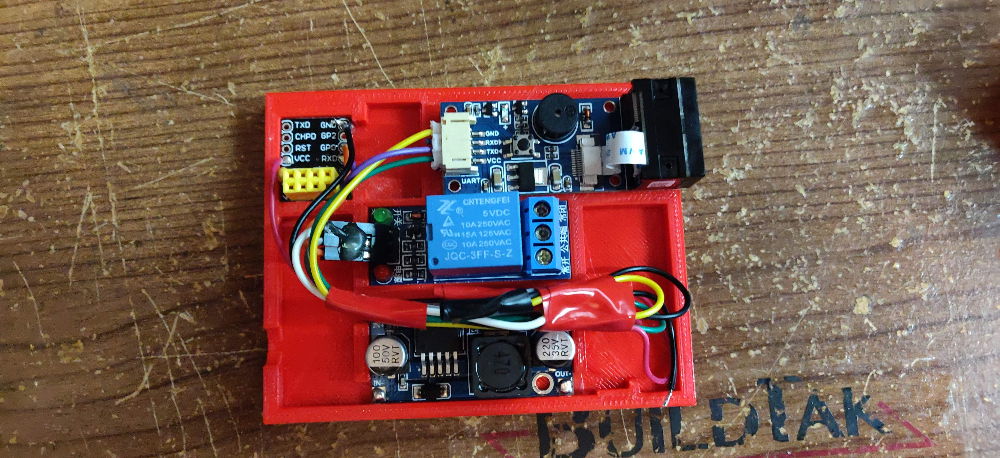

# SmartDoor
SmartDoor are software apps to make any electronic door a smart door by giving the ability to communicate to a server and record all entries.
  

##Description
SmartDoor is an Open Source software that enables any electric door handle,
gatekeeper or any device that uses an electronic aperture to become smart. It records all entries, can handle schedules for employees, visits or random entries, send invites to friends via Whatsapp or email with an android app using qr codes with time limits or permanent access.

  
##Specs
[Arduino sketch](esp8266/sketch_arduino) 
[Android webservice](android) 
[Raspberry pi scripts](puerta_scripts) 
[Raspberry pi sync](server) 
[Invitation or visits landing page](visitas) 
[Webpage for admin](desktop) 
[Esp8266 firmware dir](firmware) 
 
##Hardware sketch
 
  
##Example
I made this using other hadware components, but the result is the same, if you want to use
Raspberry Pi or equivalent just replace the Esp8266 module. 
 
  
## Contributing
Pull requests are welcome. For major changes, please open an issue first to discuss what you would like to change.

Please make sure to update tests as appropriate.
  
## License
[GPL-3.0](LICENSE)